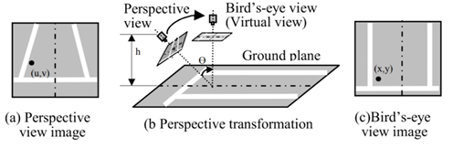
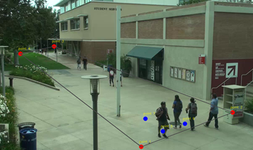
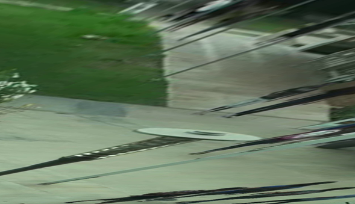

# Physical-Distancing-Monitoring-Alert-System
I have divided the whole system process into four stages:
1) **Camera Perspective Transformation**

      
      
      
2) **People detection**
3) **Inter-person distance calculation**
4)    
5) **Risk factor determination**
